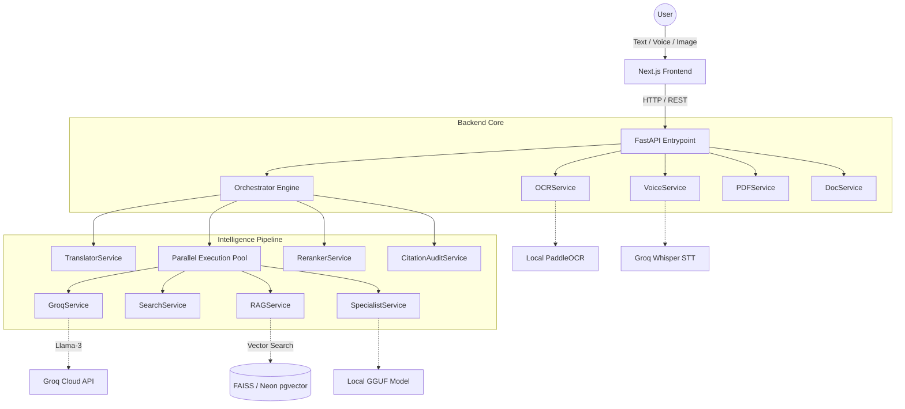
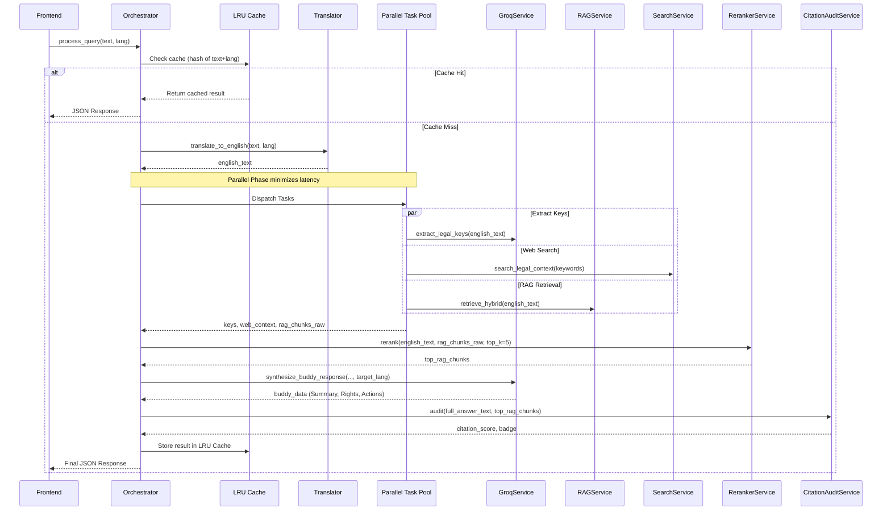

# Legal Sarathi 2.0 - System Architecture

This document details the High-Level Design (HLD) and Low-Level Design (LLD) for the Legal Sarathi 2.0 platform.

## 1. High-Level Design (HLD)

The system follows a client-server architecture. The Next.js frontend handles multimodal input (text, voice, image/PDF) and streams requests to the FastAPI backend. The backend acts as an orchestrator, distributing workloads across local ML models and fast external LLM APIs (Groq).

### Component Breakdown
- **Next.js Frontend**: "Sarkari-Modern" UI. Handles media capture and state.
- **FastAPI**: Asynchronous API server.
- **Orchestrator**: The central brain. Manages the workflow, caching, and parallel execution.
- **RAGService + RerankerService**: Two-stage retrieval. `RAGService` fetches broad candidates; `RerankerService` (CrossEncoder) scores and sorts them by semantic relevance.
- **CitationAuditService**: Post-generation step to verify LLM claims against retrieved chunks.
- **OCRService**: Uses PaddleOCR for extracting text from legal documents before analysis.

---

## 2. Low-Level Design (LLD)

The LLD focuses on the core `process_query` flow within the `Orchestrator`. It is designed for maximum speed by aggressively parallelizing I/O-bound and local compute tasks.

### Execution Details
1. **Caching**: Memory-based LRU cache prevents redundant processing for repeated queries.
2. **Translation**: All internal reasoning is done in English to maximize LLM performance. Output is translated back at synthesis.
3. **Parallel Task Pool**: Key extraction, web search, hybrid RAG, and optional local GGUF execution run concurrently using `asyncio.gather`.
4. **Re-ranking**: Raw chunks from FAISS/pgvector are passed through a CrossEncoder for high-precision ordering.
5. **Synthesis**: Groq builds structured JSON (buddy_data) containing situation, rights, actions, and constraints.
6. **Audit**: System assigns a trust badge based on how closely the synthesized response matches the source text.
