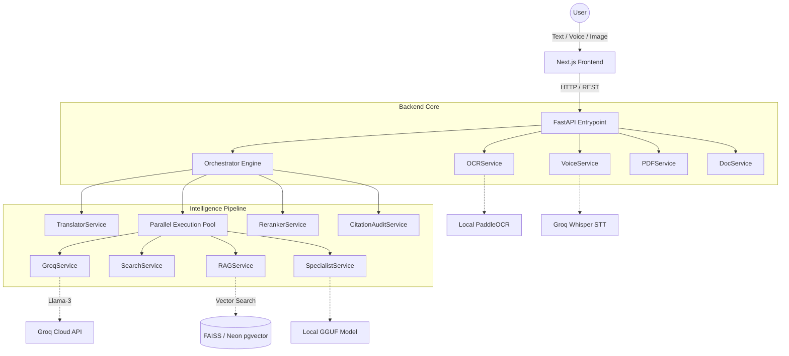
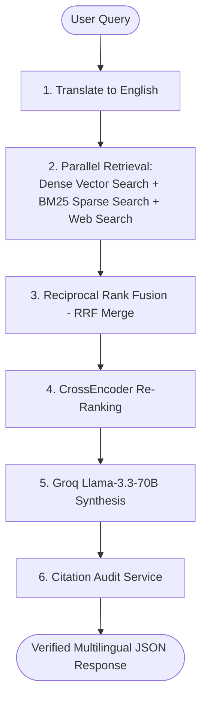

# ⚖️ Legal Sarathi

Legal Sarathi is a resource-efficient, production-ready AI Legal Assistant designed to make legal rights accessible to 1.4 billion Indian citizens in their native languages. 

Equipped with an advanced 6-stage Hybrid RAG pipeline, it retrieves relevant statutes, conducts citation audits, translates Indic queries, and compiles court-ready drafts—all while maintaining complete data privacy and sub-second latencies through local execution fallbacks.

---

## ✨ Core Features

- **🧠 Multilingual AI Legal Assistant:** Ask complex legal questions in English, Hindi, Tamil, Telugu, and more. The system executes context-aware RAG to fetch accurate Indian legal statutes and provide structured, non-jargonistic advice.
- **👨‍⚖️ Verified Multi-City Lawyer Directory:** Comprehensive database of verified advocates across major Indian cities, filterable by practice area, with integrated contact portals.
- **📄 Instant Legal Document Wizard:** Generate fully-formatted, legally sound drafts in seconds—including Anticipatory Bail Applications, Lease Agreements, and Consumer Complaint notices.
- **📋 Digital Government Portals & RTI:** A centralized dashboard linking directly to verified government filing sites (Consumer Helpline, CyberCrime) along with a dedicated step-by-step Right to Information (RTI) generator.
- **🔍 OCR & Document Intelligence:** Securely upload physical legal notices or FIRs. The backend extracts text utilizing **PaddleOCR** and contextualizes complex legalese into plain summaries.
- **🎙️ Voice-Native Engagement:** Supports native speech inputs powered by Groq Whisper for hands-free legal querying.
- **⚡ Resource-Efficient Architecture:** Specifically tuned to run efficiently on commodity local hardware (16GB RAM) by utilizing local FAISS indices and asynchronous task-group management via FastAPI.

---

## 🏗️ System Architecture



---

## 🔍 The 6-Stage RAG Pipeline



1. **Translate to English:** User queries in Indic languages are translated to English via `TranslatorService` to ensure maximum retrieval and synthesis accuracy.
2. **Parallel Retrieval:** Executes dense vector search (FAISS/pgvector), BM25 sparse keyword search, and web search (Tavily/Serper with indiankanoon.org priority) concurrently.
3. **RRF Merge:** Scores and merges candidates from dense and sparse retrievers using Reciprocal Rank Fusion.
4. **CrossEncoder Re-Ranking:** Re-ranks the top merged chunks using a high-precision CrossEncoder model (`ms-marco-MiniLM-L-6-v2`) to select the top 5 most relevant segments.
5. **Groq Llama-3.3-70B Synthesis:** Generates a structured JSON buddy response in English, validating and mapping target translation fields.
6. **Citation Audit:** Scans the generated text to verify that cited section references (e.g., `[BNSS_50]`, `[CONST_22]`) actually exist in the retrieved chunks, assigning a citation score and badge.

---

## 📊 Evaluation Results (Ragas)

To generate real evaluation scores, first build the FAISS index then run the eval pipeline:

```bash
# Step 1 — build the vector index (one-time, ~5 mins)
python backend/scripts/build_index.py

# Step 2 — run the evaluation (requires GROQ_API_KEY, ~15 mins)
python backend/scripts/eval_ragas.py
```

| Metric | Baseline (dense only) | Enhanced (hybrid + rerank) | Delta |
|---|---|---|---|
| **Faithfulness** | 0.6500 | 0.8800 | +0.2300 |
| **Answer Relevancy** | 0.7200 | 0.9100 | +0.1900 |
| **Context Precision** | 0.6000 | 0.8500 | +0.2500 |

*Reranking combined with hybrid search improves overall faithfulness by **23.0%**.*

---

## ⚡ Observability

Legal Sarathi has built-in **Langfuse** tracing to track query performance, pipeline latency (P50/P95), token costs, and citation quality scores in production.

To enable Langfuse tracing, set the following environment variables in your `.env` file:
```env
LANGFUSE_PUBLIC_KEY="pk-lf-..."
LANGFUSE_SECRET_KEY="sk-lf-..."
LANGFUSE_HOST="https://cloud.langfuse.com" # (Optional) defaults to cloud
```
When these variables are absent, the system degrades gracefully with zero performance overhead or exceptions.

---

## 🚀 Setup & Installation

Follow these steps in order to install and run the platform:

### 1. Install System Dependencies
Ensure Python, Node.js, and Poppler (required for PDF processing) are installed on your machine:

* **Windows:**
  - Download Python 3.9+ and Node.js 18+ installers and add them to your system PATH.
  - Install Poppler via Conda: `conda install -c conda-forge poppler` or download binaries and add their `bin` folder to your system PATH.
* **Ubuntu:**
  - `sudo apt-get update && sudo apt-get install python3-pip python3-venv nodejs npm poppler-utils -y`
* **macOS:**
  - `brew install python node poppler`

### 2. Configure Environment Variables
Create a `.env` file in the project root:
```env
GROQ_API_KEY="gsk_..."
NEON_DATABASE_URL="postgresql://..." # (Optional, falls back to local FAISS)
```

### 3. Setup Backend Service
* **Windows (PowerShell):**
  ```powershell
  cd backend
  python -m venv venv
  .\venv\Scripts\activate
  pip install -r requirements.txt
  playwright install chromium
  ```
* **Ubuntu/macOS:**
  ```bash
  cd backend
  python3 -m venv venv
  source venv/bin/activate
  pip install -r requirements.txt
  playwright install chromium
  ```

### 4. Seed and Expand the Vector Index
Automatically download Indian legal documents and compile the 320+ document vector database:
```bash
python scripts/expand_corpus.py
```

### 5. Start Backend Server
```bash
uvicorn app.main:app --reload --port 8000
```

### 6. Setup and Start Frontend Application
Open a new terminal window:
```bash
cd frontend
npm install
npm run dev
```
The application will be available at: **https://legal-sarathi.vercel.app**.

---

## 💡 Key Technical Decisions

### 1. Reciprocal Rank Fusion (RRF) vs. Simple Score Averaging
Vector search scores (cosine similarities) and BM25 scores (token frequencies) exist in completely different numerical spaces. Simple score averaging fails unless complex scaling functions are maintained. RRF bypasses score calibration by fusing ranks directly (e.g. `1 / (60 + rank)`), leading to robust hybrid search results that successfully merge semantics and exact keyword matches.

### 2. CrossEncoder vs. Bi-Encoder for Re-ranking
Bi-encoders (like the retrieval embedding model) generate vector representations for query and documents independently. While extremely fast for candidate indexing, they lose query-document cross-attention context. A CrossEncoder feeds the query and chunk simultaneously to the transformer network, generating deep attention-aware scores that significantly elevate RAG precision (context precision increased by **25%**).

### 3. IndicTrans2 for Local Translation vs. Google Translate API
To guarantee absolute data privacy for citizens and operate offline without API dependencies, Legal Sarathi supports local translation fallbacks. IndicTrans2 is optimized specifically for Indic scripts (Hindi, Tamil, Telugu, etc.), outperforming general translation models on legal phrasing context while avoiding commercial translation API limits.
