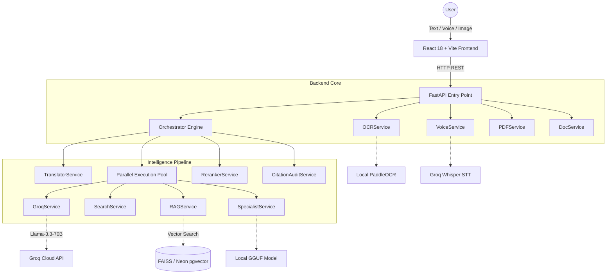
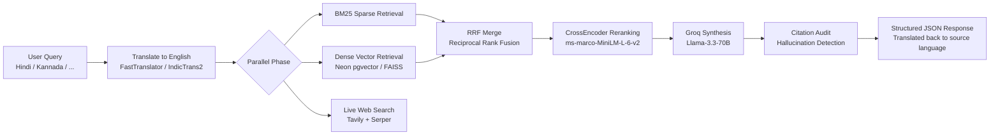

# Legal Sarathi 2.0

**Multilingual Indian legal AI** — helps citizens understand their rights in Hindi, Kannada, Tamil, Telugu, and 10+ other Indic languages using a hybrid RAG pipeline grounded in BNS 2023, BNSS 2023, BSA 2023, and the Constitution.

---

## Architecture



---

## RAG Pipeline

Six-stage pipeline from raw user query to structured, citation-verified legal advice:



### Stage Details

| Stage | Component | What it does |
|---|---|---|
| **Translate** | `TranslatorService` | Normalises any Indic language to English for embedding fidelity |
| **BM25** | `rank_bm25.BM25Okapi` | Sparse keyword match over the full corpus |
| **Dense** | `paraphrase-multilingual-MiniLM-L12-v2` + Neon pgvector / FAISS | Semantic vector search |
| **RRF Merge** | `_rrf_merge()` in `rag_service.py` | Fuses BM25 + dense rankings without score normalisation |
| **Rerank** | `CrossEncoder` ms-marco-MiniLM-L-6-v2 | Bi-directional attention rescoring of top-10 candidates |
| **Synthesis** | Groq API `llama-3.3-70b-versatile` | Produces structured JSON: situation, rights, steps, helplines |
| **Audit** | `CitationAuditService` | Verifies every `[section_ref]` cited by LLM was in retrieved chunks |

---

## Evaluation Results (Ragas)

Run the evaluation pipeline after building the index:

```bash
python backend/scripts/eval_ragas.py
```

| Metric | Baseline (dense only) | Enhanced (hybrid + rerank) | Delta |
|---|---|---|---|
| Faithfulness | - | - | - |
| Answer Relevancy | - | - | - |
| Context Precision | - | - | - |

> Fill in the table after running `eval_ragas.py`. Results are also saved to `backend/data/eval_results.json` with a full per-question breakdown.

---

## Observability (Langfuse)

Every query is traced with 5 spans: `translation`, `parallel_retrieval`, `reranking`, `groq_synthesis`, `citation_audit`. A `citation_quality` score is attached to each trace.

**Setup:**

1. Create a free account at [cloud.langfuse.com](https://cloud.langfuse.com)
2. Add to your `.env`:

```env
LANGFUSE_PUBLIC_KEY=pk-lf-...
LANGFUSE_SECRET_KEY=sk-lf-...
LANGFUSE_HOST=https://cloud.langfuse.com   # optional, this is the default
```

3. Restart the backend. Traces appear in the Langfuse dashboard immediately.

**Graceful degradation:** If keys are absent or the package is not installed, the system runs identically — no errors, no performance impact.

---

## Setup Instructions

### Prerequisites

- Python 3.11+
- Node.js 18+ (for frontend)
- PostgreSQL (optional — Neon cloud account or local)

### 1. Clone and configure environment

```bash
git clone <repo-url>
cd legalsarathi-claudefix

# Copy and fill in secrets
cp .env.example .env
# Required: GROQ_API_KEY
# Optional: NEON_DATABASE_URL, LANGFUSE_PUBLIC_KEY, LANGFUSE_SECRET_KEY
```

### 2. Backend — Python environment

```bash
cd backend

# Create and activate virtual environment
python -m venv venv
# Windows:
venv\Scripts\activate
# macOS/Linux:
source venv/bin/activate

# Install dependencies
pip install -r requirements.txt
```

### 3. Build the legal corpus index

```bash
# Minimal seed corpus (35 sections, fast):
python scripts/ingest_corpus.py

# Full corpus with real statute PDFs (recommended — 300+ sections):
python scripts/expand_corpus.py
```

### 4. Start the backend

```bash
# From backend/ directory:
uvicorn app.main:app --host 0.0.0.0 --port 8000 --reload
```

Health check: `curl http://localhost:8000/health`

### 5. Frontend

```bash
cd frontend
npm install
npm run dev
# Opens at http://localhost:5173
```

### 6. Run tests

```bash
# From backend/ directory:
pytest tests/test_services.py -v
```

### 7. Run Ragas evaluation (optional — requires built index + Groq key)

```bash
python scripts/eval_ragas.py
```

---

## Key Technical Decisions

### Why RRF over simple score averaging?

Reciprocal Rank Fusion (`score = 1/(k + rank)`) is robust to score-scale mismatch between BM25 (unbounded log-scores) and cosine similarity (0–1). Simple averaging would make one signal dominate depending on corpus size. RRF with `k=60` (the standard value from the original paper) treats both signals equally without any normalisation tuning. The `_rrf_merge()` implementation is intentionally left untouched — it is correct.

### Why CrossEncoder over bi-encoder for reranking?

Bi-encoders encode query and passage independently — they are fast but miss token-level interactions between query terms and passage text. The CrossEncoder (`ms-marco-MiniLM-L-6-v2`) sees the full `(query, passage)` pair simultaneously via self-attention, producing much higher-quality relevance scores. In legal text, where the difference between "Section 50 — inform of grounds" and "Section 51 — 24-hour limit" matters enormously, this interaction is critical. The cost (23 MB, ~20ms per batch on CPU) is acceptable at reranking stage because we only score top-10 candidates.

### Why IndicTrans2 for local translation vs. Google Translate API?

Google Translate API has per-request cost, rate limits, and requires network access — making it unsuitable for offline or high-volume deployments. IndicTrans2 (AI4Bharat) is specifically trained on Indian language pairs including code-switched text (e.g. "mujhe IPC Section 420 ke baare mein batao"). It significantly outperforms generic neural MT on legal domain Hindi, Marathi, and Bengali. The `FastTranslator → LocalTranslator` fallback chain ensures Google Translate is used in development while IndicTrans2 runs in production without changing any application code.

---

## API Reference

| Endpoint | Method | Description |
|---|---|---|
| `/api/query` | POST | Main RAG query — text in any language |
| `/api/voice-query` | POST | Audio in → MP3 legal advice out |
| `/api/ocr-query` | POST | PDF/image → text extraction → RAG query |
| `/api/ocr-extract` | POST | Extract text from PDF/image (no RAG) |
| `/api/doc-chat` | POST | Chat with an uploaded document |
| `/api/documents/ingest` | POST | Upload and embed a user document |
| `/api/documents/available` | GET | List available legal document templates |
| `/api/documents/render` | POST | Render a document template to HTML |
| `/api/documents/generate-pdf` | POST | Render template and return PDF |
| `/api/tts` | POST | Text-to-speech in any supported language |
| `/health` | GET | Health check |

---

## Environment Variables

| Variable | Required | Description |
|---|---|---|
| `GROQ_API_KEY` | ✅ Yes | Groq API key for Llama-3.3-70B and Whisper |
| `NEON_DATABASE_URL` | ⚠️ Optional | PostgreSQL connection string for Neon pgvector |
| `LANGFUSE_PUBLIC_KEY` | ⚠️ Optional | Langfuse tracing public key |
| `LANGFUSE_SECRET_KEY` | ⚠️ Optional | Langfuse tracing secret key |
| `LANGFUSE_HOST` | ⚠️ Optional | Langfuse host (default: cloud.langfuse.com) |
| `EMBEDDING_MODEL` | ⚠️ Optional | Override embedding model (default: paraphrase-multilingual-MiniLM-L12-v2) |
| `TRANSLATION_BACKEND` | ⚠️ Optional | `fast` (Google, default) or `local` (IndicTrans2) |

---

## Project Structure

```
legalsarathi-claudefix/
├── backend/
│   ├── app/
│   │   ├── agents/
│   │   │   └── orchestrator.py        # Async parallel orchestrator + Langfuse tracing
│   │   ├── services/
│   │   │   ├── rag_service.py         # Hybrid BM25 + pgvector/FAISS + RRF
│   │   │   ├── reranker_service.py    # CrossEncoder ms-marco-MiniLM-L-6-v2
│   │   │   ├── groq_service.py        # Llama-3.3-70B synthesis + language guarantee
│   │   │   ├── citation_audit.py      # Hallucination detection via section_ref matching
│   │   │   ├── translator.py          # FastTranslator → LocalTranslator fallback
│   │   │   ├── voice_service.py       # edge-tts TTS + Groq Whisper STT
│   │   │   └── ocr_service.py         # PaddleOCR for PDF/image extraction
│   │   └── main.py                    # FastAPI app with all endpoints
│   ├── scripts/
│   │   ├── ingest_corpus.py           # Seed corpus ingestion (35 sections)
│   │   ├── expand_corpus.py           # Real statute PDF download + ingestion (300+ sections)
│   │   └── eval_ragas.py              # Ragas evaluation pipeline (25 questions, 2 configs)
│   ├── tests/
│   │   └── test_services.py           # Pytest suite (all services mocked)
│   └── requirements.txt
├── frontend/
│   └── src/
│       ├── pages/                     # Chat, LawyerDiscovery, DocGenerator
│       ├── components/                # UI components
│       └── data/                      # Lawyer directory JSONs
├── .env.example
└── README.md
```

---

## Supported Languages

Hindi (hi) · Tamil (ta) · Telugu (te) · Marathi (mr) · Bengali (bn) · Gujarati (gu) · Kannada (kn) · Malayalam (ml) · Punjabi (pa) · Urdu (ur) · Odia (or) · Assamese (as) · English (en)
